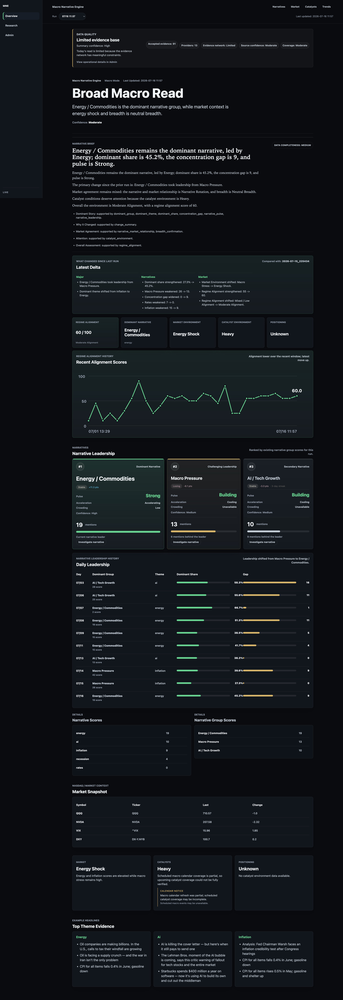
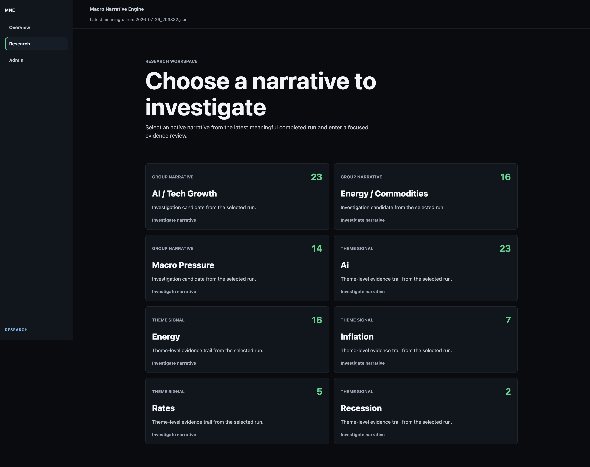

# Macro Narrative Engine

Macro Narrative Engine (MNE) is a Python-based macro intelligence platform that transforms financial news and market data into structured, explainable narratives.

It ingests headlines, removes duplicates, scores recurring themes, measures narrative concentration and momentum, compares those narratives with market behavior, and presents the results through saved reports and a FastAPI dashboard.

> MNE is an analysis and research system. It is not a trading bot and does not generate trade recommendations.

## Dashboard Preview

### Overview Dashboard



### Research Workspace



### Narrative Investigation


## Why I Built It

Financial markets produce more information than most people can review consistently. Important shifts are often distributed across headlines, sectors, macro events, and market data.

MNE was created to make that information easier to organize and interpret by answering questions such as:

- Which narratives are receiving the most attention?
- Are those narratives strengthening, cooling, or rotating?
- Is market behavior confirming or diverging from the news narrative?
- How persistent, concentrated, or crowded is the current narrative environment?

## Current Capabilities

### News and evidence pipeline

- RSS ingestion from multiple financial-news sources
- Raw and deduplicated headline storage
- Inspectable headline normalization and deduplication
- Structured evidence records and source attribution
- Taxonomy auditing for matched and unmatched headlines

### Narrative intelligence

- Theme and narrative-group scoring
- Dominant narrative and concentration analysis
- Persistence, acceleration, momentum, and crowding-risk tracking
- Narrative Leadership and Narrative Pulse
- Leadership-rotation and change summaries
- Deterministic Narrative Brief generation with traceable evidence

### Market context

- Market snapshots through `yfinance`
- Market Environment classification
- Breadth Confirmation
- Positioning Environment classification
- Regime Alignment scoring and history
- Narrative-to-market relationship analysis
- Curated Market Expression Map for contextual research

### Dashboard and reporting

- User dashboard for current narrative and market context
- Admin dashboard for diagnostics, scoring detail, evidence, and raw JSON
- Historical workflow and replay support
- Persisted JSON results and text reports
- Configurable runtime storage across macOS and Windows

## How It Works

```text
Financial news feeds
        |
        v
Evidence normalization and deduplication
        |
        v
Taxonomy-based theme detection
        |
        v
Narrative scoring and dynamics
        |
        +----------------------+
        |                      |
        v                      v
Market context           Historical memory
        |                      |
        +----------+-----------+
                   v
      Narrative Brief and dashboard
```

`main.py` orchestrates ingestion, analysis, market-context classification, persistence, and report generation. Core engine logic lives under `mne/`, while historical and narrative-dynamics analysis lives under `analysis/`.

## Technology

- Python
- pandas
- FastAPI
- Jinja2
- feedparser
- yfinance
- Git and GitHub

## Getting Started

### 1. Clone the repository

```bash
git clone https://github.com/nexusunites/macro-narrative-engine.git
cd macro-narrative-engine
```

### 2. Create and activate a virtual environment

```bash
python -m venv venv
```

macOS/Linux:

```bash
source venv/bin/activate
```

Windows PowerShell:

```powershell
venv\Scripts\Activate.ps1
```

### 3. Install dependencies

```bash
pip install -r requirements.txt
```

### 4. Configure runtime storage

### Account database and authentication

MNE stores identity, sessions, preferences, alerts, and saved views in a SQL database. Apply migrations before starting the dashboard:

```bash
export MNE_DATABASE_URL="sqlite:////absolute/path/to/mne-accounts.sqlite3"
export MNE_SESSION_SECRET="generate-and-store-a-deployment-secret"
export MNE_SECURE_COOKIES="true"
export MNE_ALLOWED_ORIGINS="https://your-mne-host.example"
alembic upgrade head
```

`MNE_DATABASE_URL` may later be a PostgreSQL URL without changing application code. `MNE_SECURE_COOKIES` is secure by default; set it to `false` only for explicit local HTTP development. `MNE_ALLOWED_ORIGINS` documents the deployment origin allowlist for the next proxy/deployment layer. `MNE_SESSION_SECRET` is reserved for deployment secret continuity; opaque sessions themselves are stored server-side.

Bootstrap the first administrator explicitly. The first signup is never promoted automatically:

```bash
export MNE_ADMIN_EMAIL="operator@example.com"
python -m mne.bootstrap_admin
```

Generate an expiring, single-use password reset token for out-of-band delivery with `python -m mne.bootstrap_admin --reset-password EMAIL`. For an explicit development fixture only, set `MNE_DEV_MODE=true` and run `python -m mne.seed_users`. There is no authentication bypass.

MNE stores generated headlines, JSON results, and reports outside the source-code repository. `MNE_DATA_DIR` is the active datastore and should point to a fast local directory. The optional `MNE_SYNC_DIR` points to a shared Google Drive directory used only by the explicit sync commands; the engine and dashboard never read it directly.

macOS/Linux:

```bash
export MNE_DATA_DIR="$HOME/MNE-data"
export MNE_SYNC_DIR="$HOME/Library/CloudStorage/GoogleDrive-macronarrativeengine@gmail.com/My Drive/MNE-data"
```

Add these exports to your own shell profile if you want them to persist. MNE does not edit shell configuration.

Windows PowerShell or Command Prompt:

```text
setx MNE_DATA_DIR "%USERPROFILE%\MNE-data"
setx MNE_SYNC_DIR "G:\My Drive\MNE-data"
```

Adjust the Drive path for your installation, then restart the terminal after using `setx`. The same variables can instead be configured through Windows System Environment Variables.

For an existing Drive-backed installation, set `MNE_DATA_DIR` to the new local directory and `MNE_SYNC_DIR` to the existing Drive directory, then perform the one-time migration:

```bash
python scripts/sync_data.py status
python scripts/sync_data.py pull
```

Sync is non-destructive: it copies new or changed files and never deletes files from either directory. This version assumes one writer. Concurrent edits on multiple machines between syncs are unsupported and resolve by last writer in the chosen direction.

### 5. Run the engine

Run the engine directly without sync:

```bash
python main.py
```

Or use the wrapper to pull first, run locally, and push only after a successful run:

```bash
python scripts/run_mne.py --pull
```

Engine arguments pass through the wrapper:

```bash
python scripts/run_mne.py --pull --mode macro
```

The safe cross-device workflow is: pull before working, run against local data, then push after success. You can also sync manually:

```bash
python scripts/sync_data.py status
python scripts/sync_data.py pull
python scripts/sync_data.py push
```

If the engine fails, the wrapper returns its exit code and does not push. Without `--pull`, the wrapper runs immediately; after a successful run it pushes when `MNE_SYNC_DIR` is configured, or reports that sync was skipped when it is not.

### 6. Start the dashboard

```bash
uvicorn dashboard:app --reload
```

Then open the local address shown in the terminal.

## Runtime Data

The configured data directory contains generated files such as:

```text
MNE-data/
├── headlines/
├── reports/
└── results/
```

Generated runtime data is intentionally separated from source code so the project can run across different devices without committing private or machine-specific history to GitHub. The local active datastore avoids cloud-streaming latency, while the optional shared directory provides explicit backup and cross-device transfer.

## Project Status

MNE currently connects RSS ingestion, evidence normalization, deduplication, taxonomy-based narrative detection, historical dynamics, market context, deterministic narrative briefs, and dashboard presentation into one working pipeline.

Current development priorities include:

- Leadership-rotation workflows
- Dedicated dashboard navigation and research pages
- Market Expression Map expansion
- Taxonomy V2 refinement
- Cloud automation and operational monitoring

See [Project Status](docs/project_status.md) and the [Roadmap](docs/roadmap.md) for more detail.

## Documentation

- [Product Vision](docs/product_vision.md)
- [Project Status](docs/project_status.md)
- [Roadmap](docs/roadmap.md)
- [Architecture](ARCHITECTURE.md)
- [Product Backlog](docs/product_backlog.md)
- [Historical Replay Engine](docs/historical_replay_engine.md)
- [Narrative Memory System](docs/narrative_memory_system.md)
- [Intelligence Experience Architecture](docs/intelligence_experience_architecture.md)
- [Research Workspace Architecture](docs/research_workspace_architecture.md)
- [Narrative Style Guide](docs/narrative_style_guide.md)
- [Security and Intellectual Property Model](docs/security_ip_model.md)

## Design Principles

- Evidence before opinion
- Understanding before prediction
- Investigation before conclusions
- Deterministic intelligence before generative AI
- Transparency before automation

## Author

**Daniel Park**  
Economics graduate building analytical tools that simplify complex information and support better decision-making.
